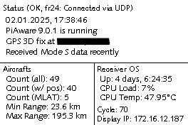

# PiAware Status Display

Based on the [Waveshare 264x176 Resolution (2.7 Inch) e-Paper Display](https://www.amazon.de/gp/product/B075FWLMRV/) this is a Status Display for my [PiAware Feeder](https://www.flightaware.com/adsb/piaware/build). It's basically to play a bit with a Raspberry Pi and e-Paper Displays and write some Python (it's the "first thing" I wrote in Python - Code is certainly far from perfect, but it works).

PiAware is just serving as a Data Source as it's running at home and provided more value to me than Weather (I can look outside after all) or Bitcoin Price. Currently the Display is connected to a Raspberry Pi 3B, but plan is to move it to one of my Raspberry Pi 4 running Docker; thus a Docker image for `linux/arm64` and `linux/arm/v7` is built from this Repository.

As a bonus the following image is written with each refresh when running outside of Docker (it's what the Display shows as well):



## Setup

In any case (Systemd vs. Docker) you'll need the repository cloned and your Raspberry Pi [to be setup](https://www.waveshare.com/wiki/2.7inch_e-Paper_HAT_Manual#Enable_SPI_Interface) to run properly with the Display.

```bash
git clone https://github.com/hexa2k9/piaware-epaper.git /opt/piaware-epaper
```

### using Systemd

This probably needs some System Packages. I cannot really remember which ones might be required as it's been [a while](https://github.com/hexa2k9/piaware-epaper/commit/9f270ae9d4dc08d16e1c89b1a685c71022770e01) since I started this.

Setup Python Virtualenv & Requirements

```bash
cd /opt/piaware-epaper
virtualenv .venv
.venv/bin/pip install -r requirements.txt
```

Install Systemd Unit

```bash
cd /opt/piaware-epaper
cp piaware-epaper.service /etc/systemd/system
systemctl daemon-reload
systemctl enable piaware-epaper.service
```

Install & Adjust Configuration

```bash
cd /opt/piaware-epaper
cp piaware-epaper.default.dist /etc/default/piaware-epaper

## Adjust as needed
vim /etc/default/piaware-epaper
```

Start Service

```bash
systemctl start piaware-epaper.service
```

### using Docker

```bash
cd /opt/piaware-epaper
cp docker-compose.override.yaml.dist docker-compose.override.yaml

# Adjust as needed
vim docker-compose.override.yaml

docker compose up -d
```

## Display Buttons

| Button   | Function       |
|----------|----------------|
| `KEY1`   | - none -       |
| `KEY2`   | Clear Display  |
| `KEY3`   | Refresh Status |
| `KEY4`   | Shutdown       |
